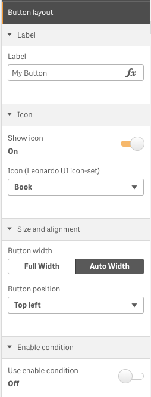
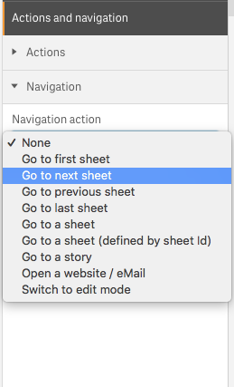

# sense-navigation
This is an extension for Qlik Sense that handels navigation and actions. This extension is a part of dashboard bundle, first delivered with Qlik Sense November 2018.

## Functionality
The extension allows you to add a button to a Qlik Sense sheet to navigate in your app:

* Go to first sheet
* Go to next sheet
* Go to previous sheet
* Go to last sheet
* Go to a sheet
* Go to a sheet (defined by sheet Id)
* Go to a story
* Open a website / eMail
* Switch to the Edit mode

Furthermore it offers the option to define a **chain of 1-n actions** which will be executed **before** the navigation happens.  

For example:

* Apply a bookmark
* Clear selections
* Lock selections
* Unlock selections
* Select value(s) in a field
* Select alternatives
* Select possible values in a field
* Set a variable value

See [here](./docs/actions.md) for a complete list of all available **20 actions**.

# Getting started

## Installation
1. Download the extension zip, `qlik-button-for-navigation.zip`, from the latest release (https://github.com/qlik-oss/sense-navigation/releases/latest)
2. Install the extension:

    a. **Qlik Sense Desktop**: unzip to a directory under [My Documents]/Qlik/Sense/Extensions.
    
    b. **Qlik Sense Server**: import the zip file in the QMC.


## Configuration
Drag & drop the object onto a sheet (as you would do it with any other native object or visualization extension).
Then define how the extension should behave:

### Layout

|        |        | 
| ------ | ------ |
|  | * **Label** - label for the button. <br>* **Icon** - If you want to combine the button label with an icon you can choose one of the provided.<br>* **Size and alignment** - Configure whether the button should spread of the entire grid column or just be as wide as necessary. And choose how the button should align within the given container.<br>* **Enable condition** - If the provided confition is false the button will be disabled. |

### Navigation Behavior

Define the behavior of the button. The following options are available:

|        |        | 
| ------ | ------ |
|  | * None<br>* Go to first sheet<br>* Go to next sheet<br>* Go to previous sheet<br>* Go to last sheet<br>* Go to a sheet _(if selected you'll see a list of sheets you can select from)_<br>* Go to a sheet (defined by sheet Id)<br>* Go to a story _(if selected you'll see a list of stories you can select from)_<br>* Open website / eMail _(if selected, you'll have to enter the URL in the appearing text box)_<br>* Switch to edit mode |

## How does it work?

If you have defined any [actions](./config-actions.md), they will first performed, then the defined _Navigation Behavior_ will be executed.

## Examples
### Example Application

If you want to try the various options of this extension, download the [sample application](https://github.com/qlik-oss/sense-navigation/tree/qlik-button-for-navigation/example)

### Mashups

This extension is built to be used within the Qlik Sense Client. Any usage in a mashup-based solution ***might work***, but there are many features which can just never work in a mashup-based solution (e.g. "Go to next sheet", "Go to edit mode", etc.). So use this extension in a mashup-based solution only at your own risk.

# Developing the extension

If you want to do code changes to the extension follow these simple steps to get going.

1. Get Qlik Sense Desktop
2. Create a new app and add qsVariable to a sheet.
3. Clone the repository
4. Run `npm install`
5. Change the path to `/dist` folder in `gulpfile.js(row 8)` to be your local extensions folder. It will be something like `C:/Users/<user>/Documents/Qlik/Sense/Extensions/qlik-button-for-navigation`.
6. Run `npm run build:debug` - this command should output unminified code to the path configured in step five.

```
// Minified output to /dist folder.
$ npm run build
```

```
// Outputs a .zip file to /dist folder.
$ npm run build:zip
```

# Original Author

**Stefan Walther**

* [qliksite.io](http://qliksite.io) - Qlik Sense / QAP related blog
* [qlikblog.at](http://qlikblog.at) - QlikView related blog
* [stefanwalther.io](http://stefanwalther.io) - Private blog
* [twitter/waltherstefan](http://twitter.com/waltherstefan)  
* [github.com/stefanwalther](http://github.com/stefanwalther)  

## Contributors
- [rvaheldendaten](https://github.com/rvaheldendaten)
- [rjriel](https://github.com/rjriel)

## License
MIT

## Related projects
Some related projects (Qlik Sense Visualization Extensions), created by [stefanwalther](http://github.com/stefanwalther)  

- [qliksense-extension-tutorial](https://www.npmjs.com/package/qliksense-extension-tutorial): Comprehensive tutorial to start developing Qlik Sense Extensions. | [homepage](https://github.com/stefanwalther/qliksense-extension-tutorial "Comprehensive tutorial to start developing Qlik Sense Extensions.")
- [sense-calendar-heatmap](https://www.npmjs.com/package/sense-calendar-heatmap): Qlik Sense Visualization Extension with a diverging color scale. The values are displayed as colored… [more](https://github.com/stefanwalther/qsCalendarHeatmap) | [homepage](https://github.com/stefanwalther/qsCalendarHeatmap "Qlik Sense Visualization Extension with a diverging color scale. The values are displayed as colored cells per day. Days are arranged into columns by week, then grouped by month and years.")
- [sense-extension-recipes](https://www.npmjs.com/package/sense-extension-recipes): Recipes on working with Qlik Sense Visualization Extensions. | [homepage](https://github.com/stefanwalther/sense-extension-recipes "Recipes on working with Qlik Sense Visualization Extensions.")
- [sense-funnel-chart](https://www.npmjs.com/package/sense-funnel-chart): Funnel Chart for Qlik Sense. | [homepage](https://github.com/stefanwalther/sense-funnel-chart "Funnel Chart for Qlik Sense.")
- [sense-media-box](https://www.npmjs.com/package/sense-media-box): Include web pages, videos, images and much more into your Qlik Sense app. | [homepage](https://github.com/stefanwalther/sense-media-box "Include web pages, videos, images and much more into your Qlik Sense app.")
- [sense-on-off-switch](https://www.npmjs.com/package/sense-on-off-switch): Set a variable in Qlik Sense to true/false using an on-off switch. | [homepage](https://github.com/stefanwalther/sense-on-off-switch "Set a variable in Qlik Sense to true/false using an on-off switch.")
- [sense-qr-code](https://www.npmjs.com/package/sense-qr-code): QR Code to be embedded into Qlik Sense. | [homepage](https://github.com/stefanwalther/qsQRCode "QR Code to be embedded into Qlik Sense.")
- [sense-range-slider](https://www.npmjs.com/package/sense-range-slider): Slider object for Qlik Sense to manipulate one or two variables. | [homepage](https://github.com/QlikDev/qsRangeSlider "Slider object for Qlik Sense to manipulate one or two variables.")
- [sense-themable-kpi-tile](https://www.npmjs.com/package/sense-themable-kpi-tile): KPI Tile for Qlik Sense with the ability to use themes or to customize background… [more](https://github.com/stefanwalther/sense-themable-kpi-tile) | [homepage](https://github.com/stefanwalther/sense-themable-kpi-tile "KPI Tile for Qlik Sense with the ability to use themes or to customize background color, comparison indicator, etc.")  